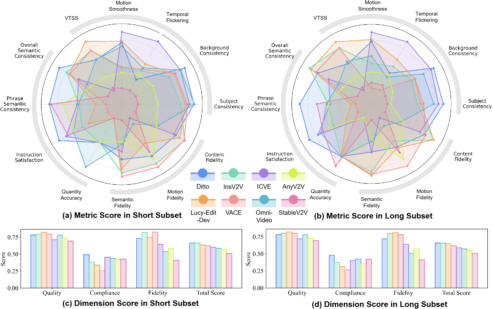

<p align="center">
    <a href="">

     </a>
   <p align="center">

<p align="center">
    <a href="https://scholar.google.com.hk/citations?user=-WKfgd0AAAAJ&hl=zh-CN"><strong>Yinan Chen <sup>1★</sup></strong></a>
    ·
    <a href="https://zhangzjn.github.io/"><strong>Jiangning Zhang <sup>1,2★</sup></strong></a>
    ·
    <a href="https://sjtuplayer.github.io/"><strong>Teng Hu <sup>3</sup></strong></a>
    ·
    <a href=""><strong>Yuxiang Zeng <sup>4</sup></strong></a>
    ·
    <a href="https://scholar.google.com/citations?hl=zh-CN&user=m3KDreEAAAAJ"><strong>Zhucun Xue <sup>1</sup></strong></a>
    ·
    <br><a href="https://scholar.google.com/citations?user=gUJWww0AAAAJ"><strong>Qingdong He <sup>2</sup></strong></a>
    ·
    <a href="https://scholar.google.com/citations?user=fqte5H4AAAAJ"><strong>Chengjie Wang <sup>2,3</sup></strong></a>
    ·
    <a href="https://scholar.google.com/citations?user=qYcgBbEAAAAJ"><strong>Yong Liu <sup>1</sup></strong></a>
    ·
    <a href="https://huuxiaobin.github.io/"><strong>Xiaobin Hu <sup>2</sup></strong></a>
    ·
    <a href="https://yanshuicheng.info/"><strong>Shuicheng Yan <sup>5</sup></strong></a>
</p>
<p align="center">
    <strong><sup>1</sup>Zhejiang University</strong> &nbsp;&nbsp;&nbsp; 
    <strong><sup>2</sup>YouTu Lab, Tencent</strong> &nbsp;&nbsp;&nbsp; 
    <strong><sup>3</sup>Shanghai Jiao Tong University</strong>
    <br>
    <strong><sup>4</sup>University of Auckland</strong> &nbsp;&nbsp;&nbsp;
    <strong><sup>5</sup>National University of Singapore</strong>
</p>
<p align="center">
    <a href='https://arxiv.org/abs/2510.11647v1'>
      
         </a>
<a href="https://huggingface.co/datasets/Coraxor/IVEBench"></a>
    <a href='https://ryanchenyn.github.io/projects/IVEBench/'>
      
         </a>
</p>
<a name="introduction"></a>

# :blush:Continuous Updates

This repository is a comprehensive collection of resources for **IVEBench**, If you find any work missing or have any suggestions, feel free to pull requests or [contact us](#contact). We will promptly add the missing papers to this repository. 


**🔥 More up-to-date instruction-guided video editing methods will continue to be updated.** 


**📝 Evaluation To-Do:**

- [x] [InsV2V](https://github.com/amazon-science/instruct-video-to-video), [StableV2V](https://github.com/AlonzoLeeeooo/StableV2V), [AnyV2V](https://github.com/TIGER-AI-Lab/AnyV2V), [VACE](https://github.com/ali-vilab/VACE)
- [x] [Lucy-Edit-Dev](https://huggingface.co/decart-ai/Lucy-Edit-Dev), [Omni-Video](https://github.com/SAIS-FUXI/Omni-Video), [ICVE](https://github.com/leoisufa/ICVE)
- [x] [Ditto](https://github.com/EzioBy/Ditto)

**🤓 You can view the scores and comparisons of each method at [IVEBench LeaderBoard](https://ryanchenyn.github.io/projects/IVEBench/#leaderboard).**

<a name="highlight"></a>

# ✨ Highlight!!!


Compared with existing video editing benchmarks, our proposed **IVEBench** offers the following key advantages:

1. **Comprehensive support for IVE methods:** IVEBench is specifically designed to evaluate instruction-guided video editing (IVE) models while remaining compatible with traditional source-target prompt-based methods, ensuring broad applicability across editing paradigms;
2. **Diverse and semantically rich video corpus:** The benchmark contains 600 high-quality source videos spanning <em>seven semantic dimensions</em> and <em>thirty topics</em>, with frame lengths ranging from 32 to 1,024, providing wide coverage of real-world scenarios;
3. **Comprehensive editing taxonomy:** IVEBench includes <em>eight major editing categories</em> and <em>thirty-five subcategories</em>, encompassing diverse editing types such as style, attribute, subject motion, camera motion, and visual effect editing, to fully represent instruction-guided behaviors;
4. **Integration of MLLM-based and traditional metrics:** The evaluation protocol combines conventional objective indicators with multimodal large language model (MLLM)-based assessments across <em>three dimensions</em> (video quality, instruction compliance, and video fidelity) for more human-aligned and holistic evaluation;
5. **Extensive benchmarking of state-of-the-art models:** We conduct a thorough quantitative and qualitative evaluation of leading IVE models—including <em>InsV2V, AnyV2V,</em> <em>StableV2V</em>, as well as the multi-conditional video editing framework <em>VACE</em>, establishing a unified and fair standard for future research.


# :mailbox_with_mail:Summary of Contents

- [Introduction](#introduction)  
- [Highlight](#highlight)  
- [Data Pipeline](#movie_camera-data-pipeline)  
- [Benchmark Statistics](#benchmark-statistics)  
- [Installation](#installation)  
  - [Install requirements](#1-install-requirements)  
  - [Install Grounding DINO requirements](#2-install-requirements-for-grounding-dino)  
  - [Download pretrained checkpoints](#3-downloads-the-checkpoints-used)  
  - [Download IVEBench Database](#4-downloads-the-ivebench-database)  
- [Usage](#usage)  
- [Experiments](#experiments)  
  - [Performance Comparison](#performance-score-of-different-methods)  
  - [Quantitative Visualization](#quantitative-visualization)  
  - [Qualitative Visualization](#quanlitative-visualization)  
- [Citation](#citation)  
- [Contact](#contact)  

<a name="pipeline"></a>

# :movie_camera: Data Pipeline


**Data acquisition and processing pipeline of IVEBench.** **1)** Curation process to 600 high-quality diverse videos. **2)** Well-designed pipeline for comprehensive editing prompts.

The playback of the source videos can be viewed on [IVEBench website](https://ryanchenyn.github.io/projects/IVEBench/#results-carousel).

<a name="benchmark-statistics"></a>

# :sunflower:Benchmark Statistics


Statistical distributions of IVEBench DB

<a name="installation"></a>

# :hammer:Installation

### 1. Install requirements

```
git clone git@github.com:RyanChenYN/IVEBench.git
cd IVEBench
conda create -n ivebench python=3.12
conda activate ivebench
pip install -r requirements.txt
```

### 2. Install requirements for Grounding DINO

Grounding DINO requires additional installation steps, which can be found in the Install section of [Grounding DINO](https://github.com/IDEA-Research/GroundingDINO)

### 3. Downloads the checkpoints used

All checkpoints utilized in this project are listed in `matrics/path.yml`.
Additionally, you may download the following pretrained models as referenced below:

- [Qwen/Qwen2.5-VL-72B-Instruct](https://huggingface.co/Qwen/Qwen2.5-VL-72B-Instruct)
- [Koala-36M/Training_Suitability_Assessment](https://huggingface.co/Koala-36M/Training_Suitability_Assessment/tree/main)
- [alibaba-pai/VideoCLIP-XL-v2](https://huggingface.co/alibaba-pai/VideoCLIP-XL-v2/tree/main)
- `baseline_offline.pth` from [facebook/cotracker3](https://huggingface.co/facebook/cotracker3)
- `groundingdino_swinb_cogcoor.pth` from [Grounding DINO](https://github.com/IDEA-Research/GroundingDINO/releases/download/v0.1.0-alpha2/groundingdino_swinb_cogcoor.pth)

After downloading the required checkpoints, you should replace the corresponding loading paths in `matrics/path.yml` with the local directories where the checkpoints are stored.

### 4. Downloads the IVEBench Database

This section provides access to the [IVEBench Database](https://huggingface.co/datasets/Coraxor/IVEBench), which contains the complete `.mp4` video data of IVEBench and a `.csv` file (the file provides the original URLs for each video in the [IVEBench Database](https://huggingface.co/datasets/Coraxor/IVEBench), except for those from the OpenHumanVid subset, which do not have corresponding URLs).
🥰You can download [IVEBench DB](https://huggingface.co/datasets/Coraxor/IVEBench) to your local path using the following command:

```
huggingface-cli download --repo-type dataset --resume-download Coraxor/IVEBench --local-dir $YOUR_LOCAL_PATH
```

<a name="usage"></a>

# :muscle:Usage

1. You first need to run your own video editing model on the [IVEBench DB](https://huggingface.co/datasets/Coraxor/IVEBench) to generate the corresponding Target Video dataset.

   - For each source video, the associated source prompt, edit prompt, target prompt, target phrase, and target span are stored in the `.json` file provided within the [IVEBench DB](https://huggingface.co/datasets/Coraxor/IVEBench).

   - The filenames of the videos in your generated Target Video dataset must match the corresponding source video names exactly.

   - The metric computation of IVEBench requires both the original and target videos to be in the form of video frame folders. Therefore, you need to convert the `.mp4` videos downloaded from [IVEBench DB](https://huggingface.co/datasets/Coraxor/IVEBench) into video frame folders. Similarly, if the target videos you generate are in `.mp4` format, they also need to be converted.

     ```
     python data_process/mp42frames_batch.py --input_path $INPUT_PATH --output_path $OUTPUT_PATH
     ```

   - The IVEBench DB contains videos ranging from **720P to 8K** resolution, with frame counts between **32 and 1024**. If your method has limitations regarding resolution or frame count, you can use `data_process/resize_batch.py` to perform downscaling and frame sampling on the frame folders converted from the IVEBench DB. This will produce a source video dataset at the maximum resolution and frame count supported by your method, making subsequent editing and evaluation more convenient.

     ```
     python data_process/resize_batch.py --input_path $INPUT_PATH --output_path $OUTPUT_PATH --size $WIDTH $HEIGHT --max_frame $MAX_FRAME
     ```

2. After you have properly set up the environment, loaded the model weights, prepared the **IVEBench DB**, and generated the **Target Video dataset** using your editing method on IVEBench DB, you can use the evaluation script below to compute the performance scores for each video in your Target Video dataset across all metrics. And the evaluation results will be exported as a **CSV file**.

   ```
   cd metrics
   python evaluate.py \
       --output_path $YOUR_TARGET_VIDEOS_DIR \
       --source_videos_path $IVEBENCHDB_SOURCE_VIDEOS_DIR \
       --target_videos_path $YOUR_TARGET_VIDEOS_DIR \
       --info_json_path PROMPT_JSON_PATH \
       --metric $LIST_OF_METRICS_YOU_NEED \
   ```

3. After obtaining the evaluation results on each videos, you can use `metrics\get_average_score.py` to get the total score of your method on the IVEBench DB, as well as the average scores across the three dimensions and all individual metrics.

   ```
   python get_average_score.py -i $INPUT_CSV -o $OUTPUT_CSV
   ```

4. It is important to note that **IVEBench** is divided into two subsets: the **IVEBench DB Short subset** and the **IVEBench DB Long subset**.
   The Short subset contains videos with **32–128 frames**, while the Long subset contains videos with **129–1024 frames**, representing a higher level of difficulty.
   If you wish to evaluate your method on the **full IVEBench DB**, you need to generate the **Target Video dataset** for both subsets separately and perform evaluation on each subset independently.

<a name="experiments"></a>

# :bar_chart:Experiments

### **Performance score of different methods**


The continuously updated, sortable table of the latest IVE methods is available on the [IVEBench website](https://ryanchenyn.github.io/projects/IVEBench/#leaderboard)


### **Quantitative Visualization**



**IVEBench Evaluation Results of Video Editing Models.** We visualize the evaluation results of four IVE models in 12 IVEBench metrics. We normalize the results per dimension for clearer comparisons.


### **Quanlitative Visualization**


Comparative demonstrations of the source videos and the target videos generated by different methods can be viewed on [IVEBench website](https://ryanchenyn.github.io/projects/IVEBench/#results-carousel2).

<a name="citation"></a>

# :black_nib:Citation

If you If you find [IVEBench](https://ryanchenyn.github.io/projects/IVEBench) useful for your research, please consider giving a star⭐ and citation📝 :)

```
@article{chen2025ivebench,
  title={IVEBench: Modern Benchmark Suite for Instruction-Guided Video Editing Assessment},
  author={Chen, Yinan and Zhang, Jiangning and Hu, Teng and Zeng, Yuxiang and Xue, Zhucun and He, Qingdong and Wang, Chengjie and Liu, Yong and Hu, Xiaobin and Yan, Shuicheng},
  journal={arXiv preprint arXiv:2510.11647},
  year={2025}
}
```


<a name="contact"></a>

# ✉️Contact

```
yinanchencs@outlook.com
```

```
186368@zju.edu.cn
```

